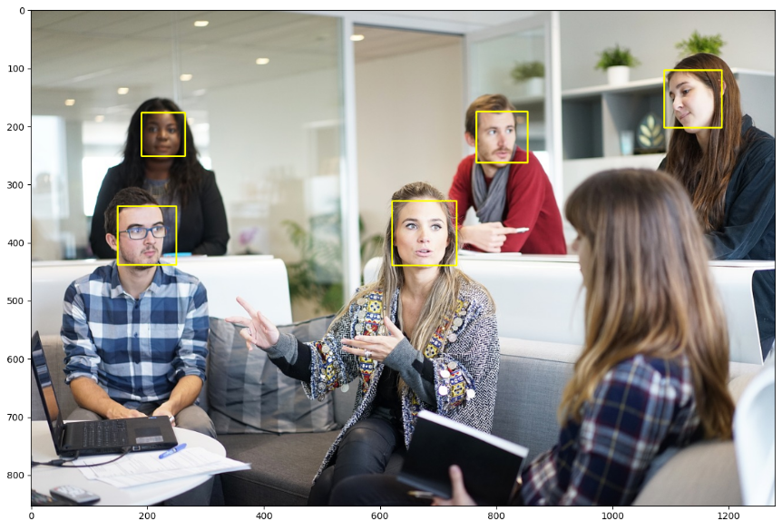

# COMPUTER VISION 
## Machine Learning model for facial recognition

1. Region of interest
2. Haar cascade classifier
3. Face classification using Eigenfaces, Fisherfaces, and LBPH algorithms
4. Facial landmarks
5. Facial landmark extraction with DLib
6. Video analysis
7. Use cases with facial landmarks

